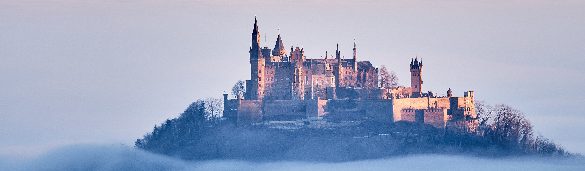

---
# Feel free to add content and custom Front Matter to this file.
# To modify the layout, see https://jekyllrb.com/docs/themes/#overriding-theme-defaults

layout: home
---

---
# Welcome to my homepage :)
---
 

This page is all about my personal projects, ideas and personal interests. Here you can find the newest and latest infos on my stuff and enjoy some computer science, electrical engineering and technology-related contents.

__<u>Things you may find here include:</u>__
- Some Robotics
- Microcontroller stuff
- Info's on repairs i've done
- Maybe some math (but not too much :>)
- A little 3D-Printing
- A LOT of LED's
- and more...

# Featured Projects

  
  
    

      <h3>
        <a href="{{ project.url }}">{{ project.title }}</a>
      </h3>
      
{{ project.description }}

    

  

 

---
# Social Links: 
- [GitHub](https://github.com/Skyfighter64)
- [iFixit](https://www.ifixit.com/User/Contributions/4374656)
- [Printables](https://www.printables.com/@Skyfighter)

---
 
Image Credits: [Nordseher on Pixabay](https://pixabay.com/de/photos/burg-architektur-schiff-nebelmeer-8519077/)
 